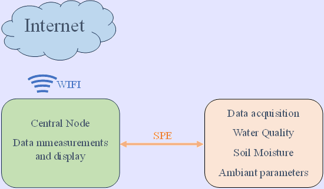

# Precise Irrigation and Smart Water Resources Management

  

Water Quality Monitoring Solution Based on Single Pair Ethernet (SPE), the goal aims to monitor Water quality, Soil moisture, and  assume crop irrigation. 

